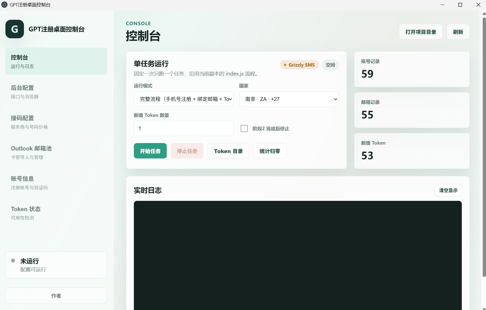

# GPT Register Pro

> 多平台接码 + 临时邮箱 + OpenAI OAuth 自动化注册桌面控制台

[](./LICENSE)
[](https://nodejs.org/)
[](https://www.electronjs.org/)

GPT Register Pro 是一个开源的 ChatGPT / Codex 账号自动化注册工具。它通过本地浏览器自动化，串联接码平台手机号验证、临时邮箱接收验证码、OpenAI OAuth 授权换取 Codex Session Token 全流程，支持桌面图形界面和命令行两种运行方式。

## 界面预览



桌面控制台包含六大功能页：控制台（运行与日志）、后台配置（接口与浏览器）、接码配置（服务商与号码价格）、Outlook 邮箱池（卡密导入与管理）、账号信息（注册账号与验证码）、Token 状态（可用性检测）。

## 接码平台注册链接

本项目支持三家接码平台，注册后获取 API Key 即可使用：

| 平台 | 注册链接 | 协议 | 特点 |
| --- | --- | --- | --- |
| **HeroSMS** | [https://hero-sms.com/](https://hero-sms.com/) | sms-activate | 稳定可靠，促销码 `plucksu` 享 85 折 |
| **Grizzly SMS** | [https://grizzlysms.com/cn/?r=1743955](https://grizzlysms.com/cn/?r=1743955) | sms-activate 兼容 | 中文界面，退款保障完善 |
| **NexSMS** | [https://user.nexsms.net/#/auth/sign-up?ref=qdMkySge](https://user.nexsms.net/#/auth/sign-up?ref=qdMkySge) | REST API | 价格透明，全量国家报价一次返回 |

## 特性

- **三大接码平台**：HeroSMS / Grizzly SMS / NexSMS 一键切换，统一接口
- **多种邮箱后端**：Cloudflare Worker 临时邮箱（零成本）、cloud-mail、Outlook 真实邮箱池
- **浏览器自动化**：基于 puppeteer-real-browser，自动绕过 Cloudflare Turnstile
- **OAuth 换 Token**：OpenAI OAuth PKCE 流程，产出 Codex Session Token（含 refresh_token）
- **Electron 桌面控制台**：可视化配置、运行监控、账号管理、Token 状态刷新
- **并发批量注册**：多 Worker 并发，支持断点续跑和分阶段恢复
- **代理支持**：HTTP / HTTPS / SOCKS5 代理，环境变量自动检测
- **Token 自动刷新**：桌面端自动检测过期 Token 并用 refresh_token 续期
- **Outlook 邮箱池**：卡密导入、消耗制管理、Graph/IMAP 双模式取件、Token 自动轮换

## 架构

```
┌─────────────────────────────────────────────────────────────┐
│                    Electron 桌面控制台                        │
│  ┌──────────┐ ┌──────────┐ ┌──────────┐ ┌───────────────┐  │
│  │ Console  │ │ Settings │ │SMS Config│ │Outlook Pool   │  │
│  │ 运行控制  │ │ 配置编辑  │ │ 价格余额  │ │ 卡密管理       │  │
│  └──────────┘ └──────────┘ └──────────┘ └───────────────┘  │
│  ┌──────────┐ ┌──────────────────────────────────────────┐  │
│  │ Accounts │ │ Token Status（自动刷新过期 Token）         │  │
│  └──────────┘ └──────────────────────────────────────────┘  │
└──────────────────────────┬──────────────────────────────────┘
                           │ IPC
                           ▼
┌─────────────────────────────────────────────────────────────┐
│                    核心注册引擎 (index.js)                    │
│                                                             │
│  ┌─────────────┐  ┌──────────────┐  ┌──────────────────┐   │
│  │ SMS Factory │  │ Mail Provider│  │ Browser Service  │   │
│  │ ┌─────────┐ │  │ ┌──────────┐ │  │ puppeteer-real-  │   │
│  │ │HeroSMS  │ │  │ │Cloudflare│ │  │ browser          │   │
│  │ ├─────────┤ │  │ │Worker    │ │  │ Turnstile bypass │   │
│  │ │Grizzly  │ │  │ ├──────────┤ │  │                  │   │
│  │ ├─────────┤ │  │ │cloud-mail│ │  │                  │   │
│  │ │NexSMS   │ │  │ ├──────────┤ │  │                  │   │
│  │ └─────────┘ │  │ │Outlook   │ │  │                  │   │
│  └─────────────┘  │ └──────────┘ │  └──────────────────┘   │
│                   └──────────────┘                          │
│  ┌─────────────┐  ┌──────────────┐  ┌──────────────────┐   │
│  │ OAuthService│  │RandomIdentity│  │DeferredCancel    │   │
│  │ PKCE 换Token│  │ 随机身份生成  │  │ 延迟取消管理      │   │
│  └─────────────┘  └──────────────┘  └──────────────────┘   │
└─────────────────────────────────────────────────────────────┘
                           │
                           ▼
              ┌────────────────────────┐
              │  OpenAI Auth Server    │
              │  auth.openai.com       │
              └────────────────────────┘
```

## 项目结构

```text
gpt-register-pro/
├── index.js                          # 核心注册引擎入口（CLI）
├── desktop/                          # Electron 桌面控制台
│   ├── main.js                       # 主进程：IPC 处理、子进程管理、配置读写
│   ├── preload.js                    # 上下文桥接
│   └── renderer/                     # 渲染进程 UI
│       ├── index.html                # 页面结构（6 个功能页）
│       ├── app.js                    # 前端逻辑
│       ├── styles.css                # 样式
│       └── assets/                   # 静态资源
├── src/                              # 核心模块
│   ├── config.js                     # 配置加载（多文件合并 + 平台默认值）
│   ├── smsProviderFactory.js         # 接码平台工厂/注册表
│   ├── smsProvider.js                # HeroSMS 客户端（sms-activate 协议）
│   ├── grizzlySmsProvider.js         # Grizzly SMS 客户端（继承 HeroSMS）
│   ├── nexSmsProvider.js             # NexSMS 客户端（REST API）
│   ├── mailProvider.js               # 统一邮箱提供商（4 种后端）
│   ├── outlookProvider.js            # Outlook 邮箱池 + OAuth2/Graph/IMAP 取件
│   ├── browserService.js             # 浏览器自动化（puppeteer-real-browser）
│   ├── oauthService.js               # OpenAI OAuth PKCE 授权 + Token 交换
│   ├── randomIdentity.js             # 随机姓名/密码生成
│   ├── deferredCancelManager.js      # SMS 激活延迟取消（退款保障）
│   ├── writeLock.js                  # 文件写入锁（并发安全）
│   ├── runLogger.js                  # 运行日志
│   └── phoneCountryCatalog.js        # 国家代码目录
├── cloudflare-email-worker.js        # Cloudflare Worker 临时邮箱后端
├── cloudflare-email-worker-schema.sql # D1 数据库表结构
├── config.example.json               # 配置模板
├── package.json
├── 使用说明.md                        # 详细使用文档
└── README.md
```

## 模块说明

### 接码平台模块

| 模块 | 职责 |
| --- | --- |
| `smsProviderFactory.js` | 统一注册表，根据 `smsProvider` 配置创建对应客户端 |
| `smsProvider.js` | HeroSMS 基础实现：获取号码、轮询短信、完成/取消激活、价格查询、国家列表 |
| `grizzlySmsProvider.js` | 继承 HeroSMS，适配 Grizzly API 差异：V1/V2 协议自动降级、3 分钟验证码等待、取消轮询重试 |
| `nexSmsProvider.js` | NexSMS REST API 独立实现：按最低价购买、无 activationId 生命周期、全量价格矩阵 |

三家平台公共接口：`getNumber()` / `markReady()` / `pollForCode()` / `complete()` / `cancel()` / `getBalance()` / `getCountries()` / `listCountryPrices()`。

### 邮箱模块

| 模块 | 职责 |
| --- | --- |
| `mailProvider.js` | 统一邮箱接口，支持 4 种后端：`cloudflare-worker`、`cloud-mail`、`legacy`、`outlook`；自动重试、会话缓存、管理员兜底查询 |
| `outlookProvider.js` | Outlook 邮箱池：卡密解析导入、消耗制状态机（available→pending→used/invalid）、OAuth2 refresh_token 换 access_token、Microsoft Graph API / IMAP XOAUTH2 双模式取件、Token 自动轮换回写 |

### 浏览器与 OAuth

| 模块 | 职责 |
| --- | --- |
| `browserService.js` | 基于 puppeteer-real-browser 启动真实 Chrome，自动绕过 Cloudflare Turnstile；支持代理、持久化 profile、并发 profile 隔离、残留进程清理、ChatGPT 登录态清理 |
| `oauthService.js` | OpenAI OAuth PKCE 流程：生成 code_verifier/challenge、构建授权 URL、回调参数提取、authorization_code 换 Token、JWT 解析 account_id、多目录 Token 文件写入 |

### 辅助模块

| 模块 | 职责 |
| --- | --- |
| `config.js` | 配置文件加载：基础 config.json + 平台覆盖（macOS=local, Linux=server）+ 环境变量代理检测 |
| `randomIdentity.js` | 随机英文姓名和强密码生成 |
| `deferredCancelManager.js` | 注册失败后延迟取消 SMS 激活，确保退款不遗漏 |
| `writeLock.js` | 基于 Promise 队列的文件写入串行化锁 |
| `runLogger.js` | 运行日志文件初始化 |
| `phoneCountryCatalog.js` | 内置国家代码目录（ISO 代码、拨号前缀、接码平台国家 ID 映射） |

## 快速开始

### 桌面版

1. 从 [Releases](https://github.com/your-org/gpt-register-pro/releases) 下载安装包（exe / msi / portable）
2. 安装并启动
3. 在「后台配置」填写接码 API Key 和邮箱配置
4. 在「控制台」点击开始

### 源码运行

```bash
# 克隆项目
git clone https://github.com/your-org/gpt-register-pro.git
cd gpt-register-pro

# 安装依赖
npm install

# 复制配置模板
cp config.example.json config.json

# 编辑 config.json，填入接码 API Key 和邮箱配置

# 启动桌面控制台
npm start

# 或命令行运行
node index.js 1
```

### 构建安装包

```bash
# 构建全部 Windows 安装包（nsis exe + msi + portable）
npm run dist

# 单独构建
npm run dist:nsis      # NSIS 安装包 .exe
npm run dist:msi       # MSI 安装包 .msi
npm run dist:portable  # 便携版 .exe
```

构建产物输出到 `desktop-release/` 目录。

## 注册流程

```
Phase 1: 接码平台获取手机号 → ChatGPT 注册页面 → 短信验证
Phase 1.5: 首次登录 → 补全 about-you 信息
Phase 2: Codex OAuth → 绑定临时邮箱 → 邮箱验证码确认
Phase 3: 邮箱登录 OAuth → PKCE 换取 Token → 保存 codex-<email>-free.json
```

支持的运行模式：

| 模式 | 命令参数 | 说明 |
| --- | --- | --- |
| 完整流程 | `node index.js N` | 注册 N 个账号并产出 Token |
| 仅手机号 | `--phone-only N` | 只注册手机号，不绑定邮箱 |
| 纯邮箱注册 | `--email` | Outlook 池模式，无需接码 |
| 绑定邮箱 | `--phase2` | 从已有账号继续绑定邮箱 |
| 换 Token | `--phase3` | 从已绑定邮箱账号换 Token |
| 批量补 Token | `--phase8` | 按 username.json 批量换 Token |
| 停在 Phase 2 | `--stop-after-phase2` | 注册+绑邮箱后停止 |

## 配置

最小配置示例：

```json
{
  "smsProvider": "herosms",
  "heroSmsApiKey": "YOUR_API_KEY",
  "heroSmsService": "dr",
  "heroSmsCountry": 16,
  "phoneCountryCode": "GB",
  "mailProvider": "cloudflare-worker",
  "mailBaseUrl": "https://your-worker.workers.dev",
  "mailAdminToken": "YOUR_TOKEN",
  "mailDomain": "yourdomain.com",
  "proxyHost": "127.0.0.1",
  "proxyPort": 7897,
  "chromePath": "C:\\Program Files\\Google\\Chrome\\Application\\chrome.exe",
  "tokenOutputDirs": ["tokens"]
}
```

详细配置说明见 [使用说明.md](./使用说明.md#6-项目配置文件)。

## 产物

| 文件 | 说明 |
| --- | --- |
| `accounts.json` | 手机号注册账号池 |
| `username.json` | 已绑定邮箱账号池 |
| `tokens/codex-*.json` | Codex Session Token（含 access_token / refresh_token / id_token） |
| `shibai.json` | 失败记录 |
| `outlook-accounts.json` | Outlook 邮箱池 |
| `logs/` | 运行日志 |

## 文档

- [使用说明.md](./使用说明.md) — 完整部署、配置、使用、排错指南
- [Cloudflare Worker 部署](./使用说明.md#5-临时邮箱配置) — 零成本临时邮箱搭建
- [Outlook 邮箱池](./使用说明.md#12-outlook-邮箱池模式) — 真实邮箱卡密使用

## 技术栈

- **运行时**：Node.js >= 18
- **桌面框架**：Electron 42.x
- **浏览器自动化**：puppeteer-real-browser + puppeteer-core
- **HTTP 客户端**：axios + https-proxy-agent + socks-proxy-agent
- **邮箱**：imapflow（Outlook IMAP）、Cloudflare Worker + D1
- **打包**：electron-builder（NSIS / MSI / Portable）

## 安全提示

- 不要把真实 API Key、邮箱密钥、账号文件、Token 文件提交到公开仓库
- `.gitignore` 已配置忽略敏感文件
- 建议生产配置放在本地，只提交 `config.example.json` 作为模板
- Token 文件包含 `refresh_token`，泄露后可被他人使用，请妥善保管

## License

[GNU Affero General Public License v3.0](./LICENSE) (AGPL-3.0)

任何使用、修改或分发本项目的产品（包括以网络服务形式对外提供）必须同样以 AGPL-3.0 开源其完整源码。
